# **はじめに**
本手順は、ITA2.0の開発（Web,API）するための開発環境を構築する手順となります<br>

<b style="color:red;">:point_right: 旧リポジトリ(it-automation2-test)より新しいリポジトリへ移行する場合は、[コンテナの解放](/ExastroPlatform/開発環境/コンテナ解放)
    を実施したのち、[開発ワークスペース準備手順](構築手順#開発ワークスペース準備手順)から実施してください。</b>

## 開発・試験環境全体図


# **事前準備**
構築するにあたって、サーバーの払い出しを受ける必要があります。環境の管理者に依頼願います。<br>
本手順を実施していくにあたり以下の情報等が必要となります。事前に準備（確認）をお願いします。<br>

- **必要な情報**
    | 必要な情報                              | 備考                                                                                                 |
    | --------------------------------------- | ---------------------------------------------------------------------------------------------------- |
    | 踏み台サーバーのIPアドレス              | 環境の管理者に確認                                                             |
    | 踏み台サーバーの接続ユーザ              | 環境の管理者に確認                                                             |
    | 踏み台サーバーのポート番号(http)    | 環境の管理者よりサーバー払い出し時に提供                                                             |
    | 開発サーバーのIPアドレス              | 環境の管理者よりサーバー払い出し時に提供                                                             |
    | サーバーの接続鍵                    | 環境の管理者より提供                                                             |
    | 個人用のGithubアカウント                | **※事前にGithubにアカウント登録してください**                                                        |
    | 個人用のGithubパスワード                | 手順の中でブラウザからgithub.comにサインインしますので、<br>サインインできるようにしておいてください |
    | 開発対象のexastro-suiteのリポジトリURL  | 開発リーダーに確認                                                                                   |
    | 開発コンテナを開くためのディレクトリ    | 開発リーダーに確認                                                                                   |

- **開発サーバーの払い出し（環境の管理者向け）**<br>
    本項目は環境の**管理者向け**の内容なので、サーバーの払出を受ける方は**不要**です（次の手順に進んでください）

    1. OpenStackの管理画面へログインする<br>
        [http://10.197.18.10/dashboard/auth/login/](http://10.197.18.10/dashboard/auth/login/)

    1. メニューより「プロジェクト」「コンピュート」配下の「インスタンス」を選択します

    1. 「インスタンスの起動」ボタンをクリックします

    1. 「インスタンスの起動」モーダル画面で以下を指定し、「インスタンスの起動」ボタンをクリック
        | 分類(モーダル左) | 項目 | 指定値 |
        | ---- | ---- | ------ |
        | 詳細 | インスタンス名 | 任意の名前 |
        | ソース | ブートソースを選択してください | インスタンススナップショット |
        | ソース | 割り当て済み | AlmaLinux8.5_exastro-devenv_yyyymmdd<br>※ 利用可能の右脇の[↑]ボタンをクリック<br>※ 日付部分は最新のものを選択 |
        | フレーバー | 割り当て済み | 使用するリソースによって選択<br>※ ky_labo_c6m8d40 (6 Core / Mem 8 Gi / Disk 40Gi) あたりを推奨 |

# **VPC準備手順**

## VSCODEインストール・設定
- **VSCODEインストール**<br>
    VSCODE ver **1.68.0**をインストールします<br>
    ※ 2022/06/14時点の最新版　[※1.68.0以外をインストールしたいときは](#VSCODEバージョン一覧)

    **以下よりインストール**<br>
    [https://update.code.visualstudio.com/1.68.0/win32-x64-user/stable](https://update.code.visualstudio.com/1.68.0/win32-x64-user/stable)

    ※既にインストール済みの方は、最新版に更新していてください<br>

- **VSCODE 自動更新の抑止**<br>
    1. VSCODEの「ファイル」⇒「ユーザ設定」⇒「設定」メニューを選択
    1. 「ユーザー」タブ　⇒　「アプリケーション」　⇒　「更新」
    1. Modeを「**manual**」に変更

        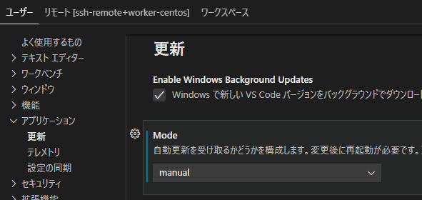
    
    1. バージョンの確認<br>
    **<span style="color: red">この設定後、「ヘルプ」⇒「バージョン情報」でVer.1.68.0になっていることを確認してください。<br>
    最新版にアップデートされている場合は、再度セットアップを実行してください。</span>**<br>
    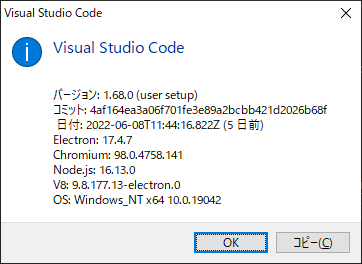

- **VSCODE ターミナルの設定**<br>
    VSCODE上のターミナルでBSキーを使うと表示が崩れる事象を回避するため、以下の設定を行います<br>

    1. VSCODEのメニューの「ファイル」⇒「ユーザ設定」⇒「設定」メニューを選択
    1. 「ユーザー」タブ　⇒　検索欄```Local Echo Latency Threshold```
    1.  ```-1```に変更<br>
        

- **VSCODE Remote Development(VSCODE拡張)のインストール**<br>
    1. VSCODEの以下の拡張機能をインストールします<br>
        ※検索欄に```Remote```と入力すると素早く検索できます<br>
        - Remote Development
        - Remote - SSH:Editing Configuration Files

        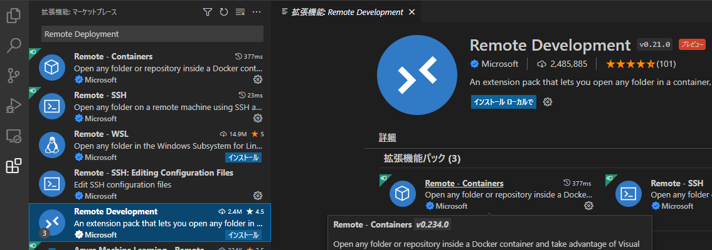

    1. VSCODE Remote Developmentのインストールの確認<br>
        リモートエクスプローラーの選択肢に「SSH Target」が**入っている**ことを確認してください<br>
        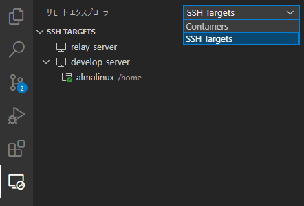

        **入っていない**時は次の手順の「VSCODE Remote Developmentの再インストール」を実施してください

    1. VSCODE Remote Developmentの再インストール<br>
        **先の手順**で、リモートエクスプローラーの選択肢に「SSH Target」が**入っていない場合**に本手順を**実施**します<br>  

        左脇の「拡張機能」を選択して「Remote - SSH」を選択後「アンインストール」をクリックします
        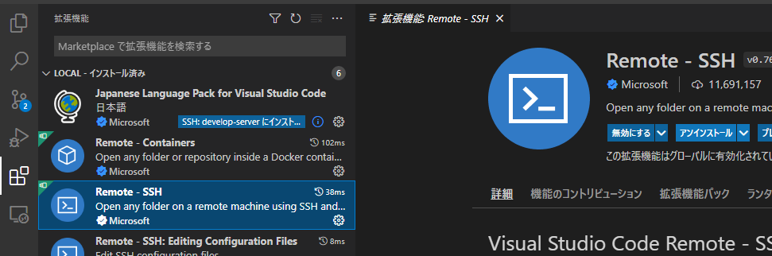

        アンインストールすると、画面上の同じ箇所に「再読み込みが必要です」が表示されますので「再読み込みが必要です」をクリックします（VSCODEが再起動します）<br>

        VSCODE再起動後、「Remote - SSH」を再度インストールします<br>
        インストール後、リモートエクスプローラーの選択肢に「SSH Target」が入っていることを再度確認してください<br>

## ssh鍵ファイルの配置

環境の管理者よりサーバー払い出し時に提供してもらった鍵ファイル(.pem)を以下のフォルダ配下に格納します<br>
- VPCの格納先フォルダ<br>
    ```${VPCアカウント}```は自身のアカウントで読み替えてください<br>
    ```
    D:\Users\${VPCアカウント}\.ssh
    ```
    ※ フォルダが存在しない場合はフォルダを作成して、格納してください<br>

    ※ 既に格納済みの場合は改めて格納は不要ですが、その場合は鍵の格納先を読み替えて設定してください<br>

## VSCODE接続先設定

1. .ssh\configファイルの編集画面起動<br>
    VSCODEで以下の操作を行います<br>
    - 左脇のリモートエクスプローラのアイコンを選択<br>
    - "SSH Targets"の欄の歯車マークをクリック<br>
    - 「```D:\Users\${VPCアカウント}\.ssh\config```」を選択<br>
        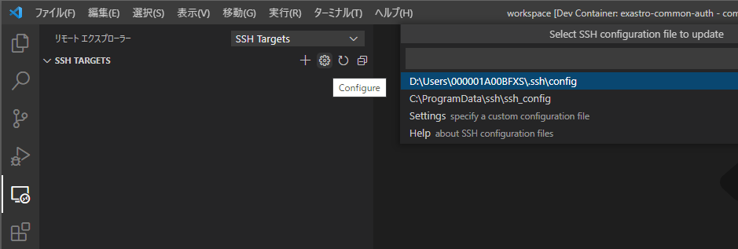   

1. .ssh\configファイルの設定追加<br>
    以下の内容を追記します

    ```ini
    Host relay-server
      #　踏み台サーバーのIPアドレスを指定
      HostName 10.xxx.xxx.xxx
      #　踏み台サーバーの接続ユーザ
      User centos
      # VPC上の鍵ファイルのパス
      IdentityFile D:\Users\${VPCアカウント}\.ssh\xxxxx.pem

    Host develop-server
      # 払い出された開発サーバのIPアドレス
      HostName 192.168.xxx.xxx
      User almalinux
      ProxyCommand ssh -W %h:%p relay-server
      # VPC上の鍵ファイルのパス
      IdentityFile D:\Users\${VPCアカウント}\.ssh\xxxxx.pem
    ```

1. 接続確認<br>
    VSCODEで以下の操作を行い、開発サーバーに接続します<br>
    - リモートエクスプローラー（SSH Targets）で「develop-server」右の「アイコン」（Connect to Host New Window)をクリック<br>
        
    - OSの選択で「Linux」を選択
    - 左上の「エクスプローラ」を選択し「フォルダーを開く」を選択し、homeディレクトリ（デフォルト:/home/almalinux）で「OK」をクリック<br>
        

# **開発サーバー準備手順**

## github personal access token払出
1. 以下のリンクを「新しいタブ」で開いてください<br>
[https://github.com/settings/tokens](https://github.com/settings/tokens)

1. 以下の画面が表示されますので、「Generate new token」をクリックします<br>
  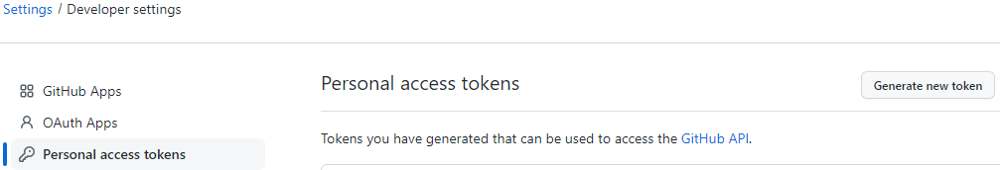

1. パスワードの確認を求められますので、パスワードを入力します

1. New Personal access token画面が表示されますので、以下の指定をして「Generate token」（画面の下の方）をクリックします
    | 指定項目   | 指定値                                                                 |
    | ---------- | ---------------------------------------------------------------------- |
    | Note       | tokenの名前（githubの一覧に出るだけなので何でもよい）                  |
    | Expiration | tokenの有効期限<br>特に問題なければ、「No expiration」（無期限）を選択 |
    | Select scopes | repoをチェックON　|                                                                        

    入力イメージ<br>
    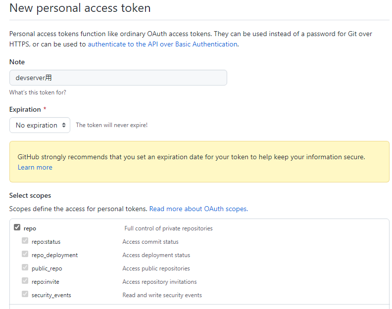

1. 「Generate token」クリック後に以下の画面が表示されますので、「ghp_＊＊＊＊」の部分を次の手順で使いますので控えておいてください<br>
    


## git設定

1. VSCODEでdevelop-serverに接続<br>
    リモートエクスプローラー(SSH Target)のalmalinux脇のフォルダアイコンをクリックします<br>
    ※ すでに接続済みの場合は、不要です<br>
    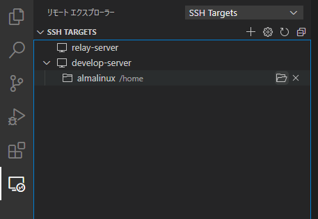

1. VSCODEでターミナル起動<br>
    VSCODEのメニューの「ターミナル」⇒「新しいターミナル」を選択します<br>
    

1. ターミナルで以下コマンドを実行<br>
    ```${gitアカウント}```と```xxxxxxxxx@ncontr.com```は自身の値を指定してください
    ```
    git config --global user.name "${gitアカウント}"
    git config --global user.email "xxxxxxxxx@ncontr.com"
    ```

1. ~/.netrcを作成

    以下のコマンドを実行
    ```bash
    vi ~/.netrc
    ```
    .netrc の内容（```ghp_**********```の部分は先の手順で取得したgithub personal access tokenを設定します）
    ```text
    machine github.com
    login githubユーザ名
    password ghp_**********************************
    ```

# **開発ワークスペース準備手順**
以下は開発対象のリポジトリ毎に実施します

## 個人リポジトリ準備

- リポジトリのfork<br>
    ※ 以下はexastro-suite/**exastro-it-automation**のリポジトリになっています<br>
    　 別のリポジトリの場合は、開発リーダから指定された開発対象のexastro-suiteのリポジトリURLをforkして下さい<br>

    ※ 旧リポジトリ(exastro-suite/it-automation2-test)から変更する場合は、改めてforkしてください。

    [https://github.com/exastro-suite/exastro-it-automation/fork](https://github.com/exastro-suite/exastro-it-automation/fork)

## 開発サーバへCLONE

- リポジトリのCLONE

    VSCODEのターミナルで、以下コマンドを実行します
    ```bash
    # 自身のGitHubアカウントを変数に格納
    # your-github-account を自身のGitHubアカウント名に変更
    MY_GITHUB_ACCOUNT="your-github-account"

    # 開発リポジトリ名を変数に格納
    # 開発リーダから聞いた開発対象のリポジトリ名を指定
    REPONAME="exastro-it-automation"
    ```

    ```bash
    # 作業用のディレクトリを作成 ※すでに作成済みの場合は、必要ありません
    mkdir -p ~/${MY_GITHUB_ACCOUNT}

    # exastro-it-automation のフォークリポジトリをクローンする
    cd ~/${MY_GITHUB_ACCOUNT}
    git clone https://github.com/${MY_GITHUB_ACCOUNT}/${REPONAME}.git

    # upstreamの設定
    cd ~/${MY_GITHUB_ACCOUNT}/${REPONAME}
    git remote add upstream https://github.com/exastro-suite/${REPONAME}.git

    # 設定内容が反映されているのを確認
    git remote -v
    ```
    結果表示イメージ<br>
    ```
    origin  https://github.com/[your-github-account]/exastro-it-automation.git (fetch)
    origin  https://github.com/[your-github-account]/exastro-it-automation.git (push)
    upstream        https://github.com/exastro-suite/exastro-it-automation.git (fetch)
    upstream        https://github.com/exastro-suite/exastro-it-automation.git (push)
    ```

## ブランチの取込と切替:new:

fork後にcloneした環境では、デフォルトだとmainブランチ以外は取り込まれておりません。次の手順を実施して、ブランチの取り込みを行います。

※forkした際に、mainブランチのみのチェックをしなかった場合は、ブランチが反映済みとなっております。
以下のコマンドを入力して、対象のブランチがあれば取り込みは不要となります。
```bash
git branch
```
結果（2.0を開発対象とする場合の例）
```
* 2.0
  main
```

#### 上流リポジトリ(exastro-suite)のブランチ取込

1. 「プル、プッシュ」「すべてのリモートからフェッチ」を選択します

    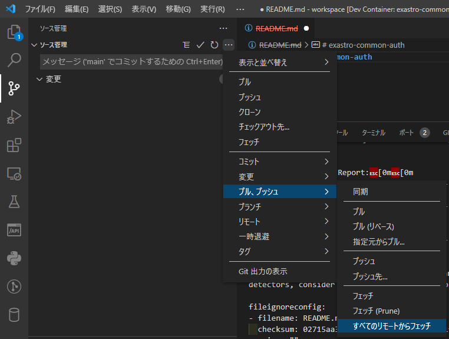

1. VSCODEでターミナルを起動し、forkしたローカルのリポジトリで以下のコマンドを実行します

    ```
    git checkout -b [取り込むブランチ] upstream/[取り込むブランチ]
    git branch --unset-upstream
    ```
    
1. VSCODEで当該リポジトリを最新表示します<br>
    以下のアイコンをクリック<br>
    
    
1. VSCODE上に「ブランチの発行」のボタンが表示されますので、クリックします

    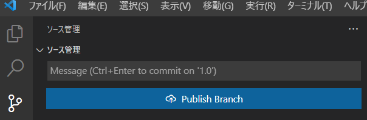

1. VSCODEのコマンドパレットにoriginとupstreamの選択がでますので**originを選択**します<br>
    するとforkしたリポジトリに[取り込んだブランチ]が作成されます

    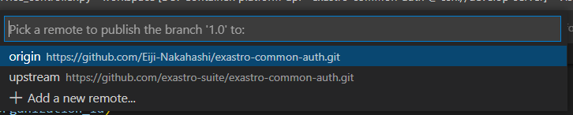


#### ブランチの切替

1. 取り込んだブランチで、開発するブランチをVSCODEから選択します

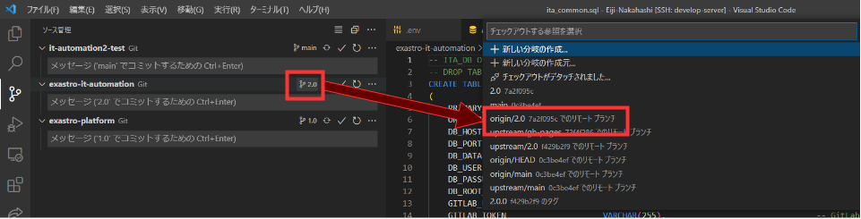

選択対象は、「origin/xx.xx」を選択します。(upstreamは選択しません）

※ブランチの運用方法については、[/ExastroPlatform/開発環境/github 運用](/ExastroPlatform/開発環境/github 運用)を確認してください。


## envファイルの作成:new:

1. devcontainerを起動する前に、envファイルを設定する必要があります。

    ※システムごとに使用する環境変数は、<br>
    `/home/almalinux/[Your GitHub Account]/exastro-it-automation/.devcontainer`内の
    <span style="color:red;">.envに記載</span>する必要があります。<br>
    `.env.sample`の内容をもとに、.envファイルを作成して、起動してください。<br>
    先に起動してしまった場合は、再度rebuildを実行してください。
    
    `\\abkfs04.nsl.ad.nec.co.jp\a06006-01\30_Exastro_IT-Automation\01_開発計画\V2.0検討\80_環境\開発環境について\docker-compose.ymlの環境変数`の.envをコピーしていただくことでも構いません。
    
    ※.envは、gitには登録されませんが、他の名称だとgitに公開されます、<span style="color:red;">秘匿情報を扱う場合は、gitに登録されないように注意</span>してください。 


## VSCode ディレクトリ追加

1. VSCODEのリモートエクスプローラー(SSH Targets)でdevelop-server脇のアイコン（Connect to Host in New Window）をクリックします

    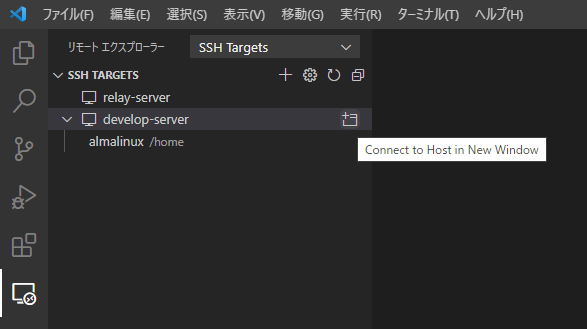

1. VSCODEの画面が新たに立ち上がります

1. VSCODEのエクスプローラー（左脇のアイコン）を選択し、「フォルダーを開く」ボタンをクリックします<br>
    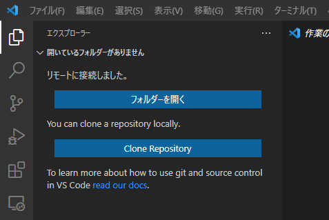

1. VSCODEの上部にディレクトリの選択が表示されますので、開発対象のコンテナを開くためのディレクトリを選択します<br>
    exastro-suite/**exastro-it-automation**のAPIを開発する際は以下を指定します<br>
    （**画像と選択するディレクトリは違います**）
    
    ```
    /home/almalinux/${MY_GITHUB_ACCOUNT}/exastro-it-automation/.devcontainer/ita-api-organization
    ```
    
    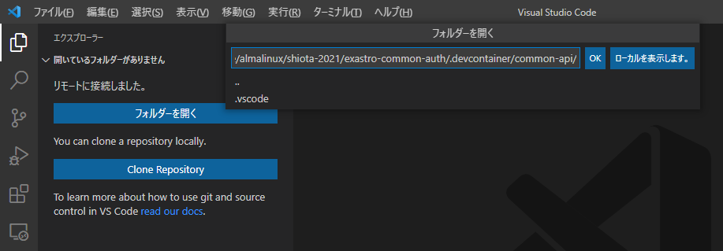


## 開発コンテナ環境 起動確認

1. VSCODEを起動し、リモートエクスプローラー(SSH Targets)から作業対象のコンテナのディレクトリを開きます<br>
    ※ ita-api-organizationを開きます<br>
    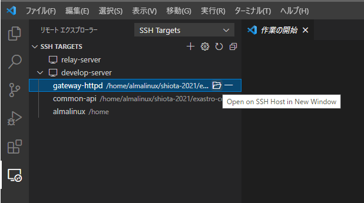

    <div style="color: red">
    ※ VSCODEが起動している場合はすべて閉じてから実行してください
    </div>
    

1. コンテナで起動<br>
    以下の**どちらか**の操作を行います
    - 右下の通知に表示される「Reopen in Container」をクリック<br>
        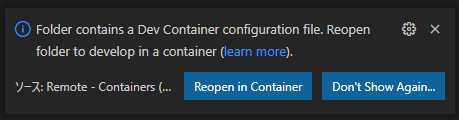

    - 左下の「>< SSH: develop-server」をクリックし、「Reopen in Container」を選択<br>
        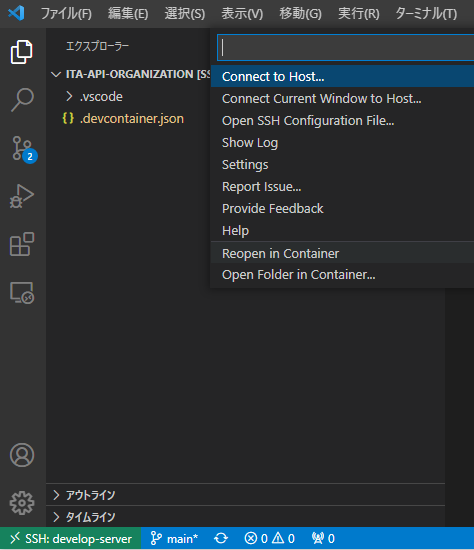

    ※ 初回起動時はコンテナのビルドが行われるので暫くかかります<br>
    ※ ２つ同時にコンテナビルドを実行しないようにしてください（ビルドを平行させるとエラーとなります）<br>
    ※ 起動中、右下に表示される「Starting Dev Container (show log)」を押下することで、ビルド状況が表示されます、エラーがあった際もこちらに表示されます

    コンテナビルド時に以下のメッセージが表示されることがあります（コンテナビルド時はほぼほぼ出ます）<br>
    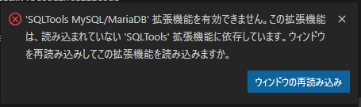<br>
    その際は「ウィンドウの再読み込み」をクリックしてください<br>

1. 利用手順<br>
    実際にVSCODEで開発をしていく手順は以下に記載しています<br>
    [/ExastroPlatform/開発環境/利用方法](/ExastroPlatform/開発環境/利用方法)


# **付録**
## VSCODEバージョン一覧

以下よりVSCODEのリリース一覧を確認できます<br>
[https://code.visualstudio.com/updates/](https://code.visualstudio.com/updates/)<br>

インストールは「Windows」のUserリンクをクリックします<br>
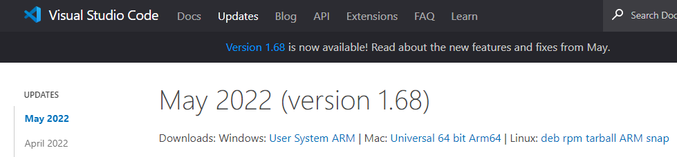